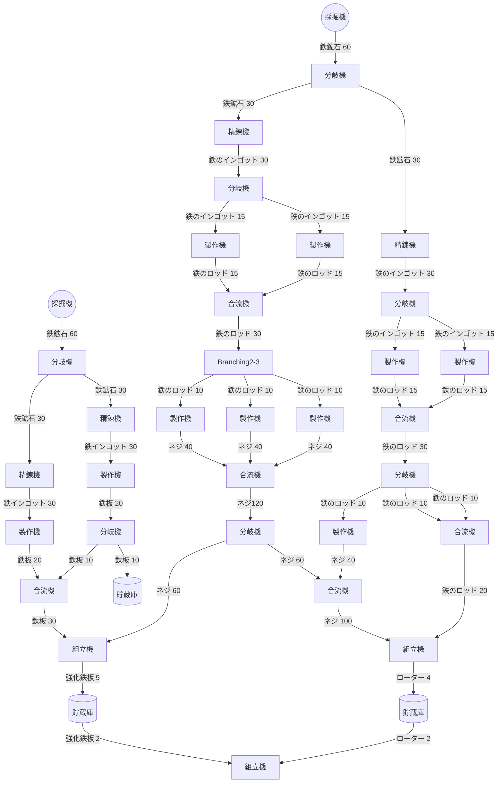

# 軌道エレベーター資源納品1

## これは何？

SatisFactoryのラインのテンプレです。
軌道エレベーター1ではスマート・プレートを50個納品する必要があるので、そこまで自動化します。

## 前提条件

- Tier2までの内容までをすべて進めている
  - Tier2までの技術しか使用できないため、効率がいいわけではないことに留意しておく
    - ~~コンベアベルト、コンベアリフトはMk.2（120/m）~~
      - Mk.2は強化鉄板を素材に使うので、安定供給ができるまで本当に必要な箇所だけに使う
    - 採掘機はMk.1だけ
    - コンベア分岐機、合流機が使用可能
- 土台等を利用して建設に必要な土地を十分確保している
- 無理に最高効率を目指さない
  - 最悪動けばいい
  - 多分他の人の公開しているラインのほうが効率いいので、最高効率を目指している方はあまり参考にならないかも
- 新しいTierが開放され、現在より効率の向上が見込めるようになった場合、躊躇なくラインを再構成できる心構えをしておく
  - 一度作ったラインを破壊するのは忍びないが、再配置等はあまりストレスなく行うことができるので積極的にラインをぶち壊していく

## 各種アイテム生産情報

|アイテム名|作成手段|必要アイテム(数/m)|作成数|効率|
| -- | -- | -- | -- | -- |
|鉄鉱石|採鉱機Mk.1| ~ | ~ |30, 60, 120/m(鉱脈の純度によって変動)|
|銅鉱石|採鉱機Mk.1| ~ | ~ |30, 60, 120/m(鉱脈の純度によって変動)|
|石灰石|採鉱機Mk.1| ~ | ~ |30, 60, 120/m(鉱脈の純度によって変動)|
|鉄のインゴット|精錬炉|鉄鉱石(30/m)|1|30/m|
|銅のインゴット|精錬炉|銅鉱石(30/m)|1|30/m|
|鉄板|制作機|鉄のインゴット(30/m)|2|20/m|
|鉄のロッド|制作機|鉄のインゴット(15/m)|1|15/m|
|ネジ|制作機|鉄のロッド(10/m)|4|40/m|
|ワイヤー|制作機|銅のインゴット(15/m)|2|30/m|
|ケーブル|制作機|ワイヤー(60/m)|1|30/m|
|強化鉄板|組立機|鉄板(30/m), ネジ(60/m)|1|5/m|
|ローター|組立機|鉄のロッド(20/m), ネジ(100/m)|1|4/m|
|スマート・プレート|組立機|強化鉄板(2/m), ローター(2/m)|1|5/m|

## ライン図

